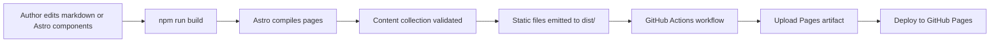

# Thought Process

Thought Process is Jason Paolasini's writing home on the web.

It is a cloud-native focused blog built to capture ideas before they disappear, turn working notes into durable writing, and create a public record of lessons, arguments, and observations shaped by real engineering work.

The site sits at the intersection of:

- cloud native computing
- platform engineering
- Kubernetes
- open source
- platform thinking
- engineering leadership
- systems, tooling, and the work behind the work

## Purpose

This site exists to do a few things well:

- document what is being learned in real time
- turn half-formed ideas into sharper public thinking
- publish technical and leadership writing without waiting for it to feel overly polished
- create a body of work that can be compared against the best thinking in the industry
- maintain a durable archive of ideas, experiments, and hard-earned lessons

This is not meant to be a content mill.

It is meant to be a deliberate writing system.

## Stack

- [Astro](https://astro.build/) for the site framework
- Markdown content collections for posts
- Svelte for the theme toggle component
- GitHub Pages for hosting
- GitHub Actions for build and deploy

## Running Locally

Prerequisites:

- Node.js 20+
- npm

Install dependencies:

```bash
npm install
```

Start the local dev server:

```bash
npm run dev
```

Astro will start a local server and watch for changes in:

- `src/pages`
- `src/components`
- `src/data/blog-posts`
- `src/styles`

Preview a production build locally:

```bash
npm run build
npm run preview
```

## Available Commands

| Command | Purpose |
| --- | --- |
| `npm run dev` | Start Astro in development mode |
| `npm run start` | Alias for `npm run dev` |
| `npm run build` | Create a production build in `dist/` |
| `npm run preview` | Serve the built output locally |
| `npm run astro -- ...` | Run Astro CLI commands directly |

## Project Structure

```text
.
├── .github/
│   └── workflows/
│       ├── deploy.yml
│       └── test.yml
├── public/
│   ├── assets/
│   │   ├── blog/
│   │   ├── fonts/
│   │   ├── jasonpaolasini.jpg
│   │   ├── logo.png
│   │   └── social.png
│   └── robots.txt
├── src/
│   ├── components/
│   │   ├── BaseHead.astro
│   │   ├── Bio.astro
│   │   ├── Footer.astro
│   │   ├── Header.astro
│   │   ├── Logo.astro
│   │   ├── Nav.astro
│   │   └── ThemeToggleButton.svelte
│   ├── data/
│   │   └── blog-posts/
│   ├── layouts/
│   │   └── BaseLayout.astro
│   ├── pages/
│   │   ├── about.astro
│   │   ├── blog/
│   │   │   ├── [slug].astro
│   │   │   └── index.astro
│   │   └── index.astro
│   ├── styles/
│   │   ├── fonts.css
│   │   └── global.css
│   └── content.config.js
├── astro.config.mjs
├── package.json
└── README.md
```

## How Content Works

Blog posts live in `src/data/blog-posts/` as Markdown files.

Each post includes frontmatter like:

```md
---
title: Post title
slug: post-slug
publishDate: 12 Mar 2026
description: Short summary for listings and metadata.
---
```

The content collection is defined in [src/content.config.js](/Users/jason/code/jpaolasini/thought-process/src/content.config.js), which validates:

- `title`
- `slug`
- `publishDate`
- `description`

Routes are generated from the `slug`, not the filename. That means the frontmatter controls the final URL.

## How Rendering Works

Astro pulls content from the collection, renders Markdown into HTML, and wraps it in the blog layout.

Key rendering path:

1. Markdown lives in `src/data/blog-posts/`
2. `src/content.config.js` defines the collection and schema
3. `src/pages/blog/[slug].astro` generates static paths from the collection
4. `render(post)` transforms markdown content into HTML
5. `BaseLayout.astro` wraps the page with shared header, footer, and metadata
6. `global.css` applies typography and article styling

## Mermaid: Site Architecture

```mermaid
flowchart TD
  A[src/data/blog-posts/*.md] --> B[src/content.config.js]
  B --> C[src/pages/blog/[slug].astro]
  C --> D[render(post)]
  D --> E[BaseLayout.astro]
  E --> F[BaseHead.astro]
  E --> G[Header.astro]
  E --> H[Footer.astro]
  G --> I[Logo.astro]
  G --> J[Nav.astro]
  J --> K[ThemeToggleButton.svelte]
  E --> L[global.css]
  E --> M[fonts.css]
  C --> N[Bio.astro]
```

## Mermaid: Build and Deploy Flow



## Deployment

Deployment is handled by [deploy.yml](/Users/jason/code/jpaolasini/thought-process/.github/workflows/deploy.yml).

On every push to `main`, GitHub Actions will:

1. check out the repository
2. install dependencies with `npm ci`
3. build the Astro site
4. upload `dist/` as the Pages artifact
5. deploy to GitHub Pages

The Astro config in [astro.config.mjs](/Users/jason/code/jpaolasini/thought-process/astro.config.mjs) conditionally applies the GitHub Pages `base` path during Actions builds so local development remains clean while production routes resolve correctly.

Validation is handled separately by [test.yml](/Users/jason/code/jpaolasini/thought-process/.github/workflows/test.yml), which runs on every branch push and pull request and executes `npm run test` to ensure the project checks and compiles successfully.

## Contributing

Contributions are welcome, but the bar should stay high.

Good contributions include:

- fixing broken layouts or rendering issues
- improving markdown styling and readability
- cleaning up content structure
- improving accessibility
- tightening performance or deploy reliability
- correcting typos, metadata, or broken links

Recommended contribution flow:

1. Create a branch from `main`.
2. Make the smallest coherent change that solves the problem.
3. Run the local site and check the relevant page.
4. Run a production build locally with `npm run build`.
5. Open a pull request with a clear summary of what changed and why.

If you are changing content:

- preserve the voice of the site
- prefer clarity over cleverness
- keep arguments concrete
- avoid filler and generic AI-sounding phrasing

If you are changing code:

- keep the Astro structure simple
- avoid unnecessary abstractions
- prefer readable, local changes over framework gymnastics

## Writing Guidelines

Posts on this site should generally aim for:

- strong, specific titles
- clear arguments early
- section breaks that improve scanning
- examples over abstraction
- useful conclusions, not vague endings

This site is intentionally opinionated about writing:

- publish before perfect
- think in public
- keep receipts
- make lessons reusable

## Assets and Naming

Static assets live in `public/assets/`.

Preferred conventions:

- use lowercase filenames
- use hyphens, not spaces
- choose descriptive names
- keep blog images under `public/assets/blog/`

Example:

```text
horse-tractor-ai-machine.png
```

Not:

```text
ChatGPT Image Mar 12, 2026, 12_01_25 AM.png
```

## Known Gaps

There are still a few areas worth improving:

- the README may evolve as the content model grows
- post filenames should be standardized further
- richer metadata and social image generation could be added later
- tests and automated linting are not yet set up

## License

This project is licensed under the terms defined in [LICENSE](/Users/jason/code/jpaolasini/thought-process/LICENSE).
